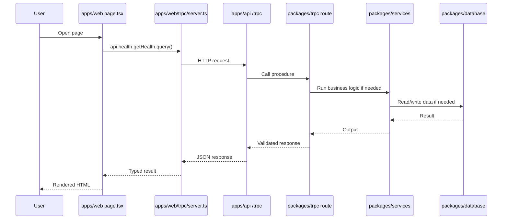

# Monorepo Guide For This Project

This file is a beginner-friendly guide to how this repo is organized, where code should go, and what order to follow so you avoid the most common errors.

## The 30-second mental model

This repo is split into apps and shared packages:

- `apps/web`: the Next.js frontend
- `apps/api`: the Express server that exposes tRPC and OpenAPI routes
- `packages/trpc`: the shared API contract between frontend and backend
- `packages/services`: business logic
- `packages/database`: Drizzle ORM, schema, and migrations
- `packages/logger`: logging
- `packages/typescript-config` and `packages/eslint-config`: shared tooling

The most important rule in this repo is:

> UI code in `apps/web` should not talk directly to the database.  
> The safe path is: `web -> tRPC -> services -> database`.

---

## Architecture Flow

```mermaid
flowchart LR
    U[User / Browser]
    W[apps/web<br/>Next.js App Router]
    WS[apps/web/trpc/server.ts<br/>Server component caller]
    WC[apps/web/trpc/client.ts<br/>Client React hooks]
    P[apps/web/providers/global.tsx<br/>React Query + tRPC Provider]
    A[apps/api<br/>Express server]
    T[packages/trpc/server<br/>Routers and procedures]
    S[packages/services<br/>Business logic]
    D[packages/database<br/>Drizzle ORM + PostgreSQL]
    L[packages/logger]
    O[/api + /docs<br/>OpenAPI + Scalar docs]

    U --> W
    W --> WS
    W --> WC
    WC --> P
    WS --> A
    P --> A
    A --> T
    A --> O
    A --> L
    T --> S
    S --> D
```

## Folder Map

```text
trpc-monorepo/
|- apps/
|  |- web/                      # Frontend app (Next.js 16 + React 19)
|  |  |- app/                  # App Router pages/layouts
|  |  |- providers/            # Global React providers
|  |  |- trpc/                 # Web-side tRPC clients
|  |  |- components/           # UI and reusable frontend components
|  |
|  |- api/                     # Backend app (Express)
|     |- src/index.ts          # Server boot
|     |- src/server.ts         # Express routes + tRPC middleware
|
|- packages/
|  |- trpc/                    # Shared router types and route definitions
|  |  |- server/
|  |  |  |- routes/            # tRPC route groups
|  |  |  |- trpc.ts            # initTRPC setup
|  |  |  |- context.ts         # request context (currently empty)
|  |  |- client/               # shared tRPC client types
|  |
|  |- services/                # business logic layer
|  |- database/                # Drizzle schema, DB connection, migrations
|  |- logger/                  # Winston logger
|  |- typescript-config/       # shared tsconfig
|  |- eslint-config/           # shared lint config
|
|- package.json                # root scripts
|- turbo.json                  # monorepo task orchestration
|- pnpm-workspace.yaml         # workspace package discovery
|- docker-compose.yml          # local PostgreSQL
```

---

## What Each Layer Is Responsible For

| Layer               | Write here when you need to...                                           | Avoid doing...                                          |
| ------------------- | ------------------------------------------------------------------------ | ------------------------------------------------------- |
| `apps/web`          | build pages, forms, buttons, client hooks, server-rendered UI            | DB queries, backend business rules                      |
| `apps/api`          | boot the backend server, configure CORS, expose `/trpc`, `/api`, `/docs` | putting app-specific business logic in Express handlers |
| `packages/trpc`     | define API procedures, input/output schemas, route grouping              | heavy logic, SQL, React UI                              |
| `packages/services` | business rules, orchestration, provider integrations                     | rendering UI, Express setup                             |
| `packages/database` | tables, schema, migrations, DB connection                                | frontend imports                                        |
| `packages/logger`   | logging utilities                                                        | feature logic                                           |

---

## How Requests Move Through The System

### 1. Server-rendered page flow

This is the pattern already used in `apps/web/app/page.tsx`.



### 2. Client component flow

Use this when the UI is interactive and should fetch/refetch in the browser.

- `apps/web/providers/global.tsx` creates the React Query client and the tRPC provider.
- `apps/web/trpc/client.ts` creates typed hooks with `createTRPCReact`.
- Client components must include `"use client"` at the top.

Safe rule:

- If it is a page or component that can load on the server first, prefer `apps/web/trpc/server.ts`.
- If it needs browser interactivity, form submission state, or refetching, use client hooks from `apps/web/trpc/client.ts`.

---

## The Safe Way To Add A New Feature

When you want to add something new, follow this order.

### Case A: UI-only change

If you are only changing layout, styling, or static text:

1. Work only in `apps/web`.
2. Use files under `app/`, `components/`, `hooks/`, or `providers/`.
3. Run `pnpm check-types` and `pnpm lint`.

### Case B: New API feature without database change

Example: return a list of supported sign-in providers.

1. Put business logic in `packages/services`.
2. Define or reuse Zod models for the response.
3. Add a tRPC procedure in `packages/trpc/server/routes/.../route.ts`.
4. Expose it through the main router in `packages/trpc/server/index.ts` if it is a new route group.
5. Call it from `apps/web`.

### Case C: New feature with database change

Example: save profile data or create a new table.

1. Update schema in `packages/database/models/...`
2. Re-export from `packages/database/schema.ts` if needed
3. Run:
   - `pnpm db:generate`
   - `pnpm db:migrate`
4. Add business logic in `packages/services`
5. Add tRPC route in `packages/trpc`
6. Use it from `apps/web`
7. Run `pnpm check-types` and `pnpm lint`

---

## Real Examples From This Repo

### Example 1: Health check

Files involved:

- `packages/trpc/server/routes/health/route.ts`
- `apps/web/app/page.tsx`

What happens:

1. The page calls `api.health.getHealth.query()` from `apps/web/trpc/server.ts`
2. The API request goes to `apps/api/src/server.ts`
3. The tRPC router handles it in `packages/trpc/server/routes/health/route.ts`
4. A typed object is returned

This is the smallest example of the full flow.

### Example 2: Authentication providers

Files involved:

- `packages/trpc/server/routes/auth/route.ts`
- `packages/services/user/index.ts`
- `packages/services/clients/google-oauth.ts`
- `packages/services/user/model.ts`

What happens:

1. The tRPC route defines the endpoint and output type
2. The service checks whether Google OAuth env vars exist
3. If they exist, it builds an auth URL
4. The route returns that typed list to the caller

This is the pattern to copy for most business features.

---

## How To Decide Where New Code Belongs

Use this quick decision map:

```text
Need a page, button, form, layout, or component?
-> apps/web

Need a typed backend procedure the frontend can call?
-> packages/trpc

Need business logic, provider integration, or data orchestration?
-> packages/services

Need tables, migrations, or DB access?
-> packages/database

Need to change ports, middleware, CORS, /docs, or server boot?
-> apps/api
```

---

## Important Files You Should Know First

### Frontend

- `apps/web/app/page.tsx`
  Current example of a server component calling the API.
- `apps/web/trpc/server.ts`
  Server-side typed tRPC client.
- `apps/web/trpc/client.ts`
  Client-side typed tRPC hooks.
- `apps/web/trpc/create-client.ts`
  Central place for the API URL and fetch behavior.
- `apps/web/providers/global.tsx`
  React Query + tRPC provider setup.

### Backend

- `apps/api/src/index.ts`
  Starts the HTTP server.
- `apps/api/src/server.ts`
  Registers Express routes, `/trpc`, `/api`, `/docs`, and OpenAPI.

### Shared contract

- `packages/trpc/server/index.ts`
  Root router combining route groups.
- `packages/trpc/server/trpc.ts`
  `initTRPC` setup.
- `packages/trpc/server/schema.ts`
  Shared Zod exports.

### Business logic and data

- `packages/services/user/index.ts`
  Example service layer.
- `packages/database/index.ts`
  Drizzle DB connection.
- `packages/database/models/user.ts`
  Example schema/table definition.

---

## Starter Pattern You Can Copy

### 1. Add or update a service

```ts
// packages/services/example/index.ts
class ExampleService {
  async listItems() {
    return [{ id: "1", name: "Demo" }];
  }
}

export default ExampleService;
```

### 2. Add a route

```ts
// packages/trpc/server/routes/example/route.ts
import { z } from "../../schema";
import { publicProcedure, router } from "../../trpc";

export const exampleRouter = router({
  listItems: publicProcedure
    .input(z.undefined())
    .output(
      z.array(
        z.object({
          id: z.string(),
          name: z.string(),
        }),
      ),
    )
    .query(async () => {
      return [{ id: "1", name: "Demo" }];
    }),
});
```

### 3. Add the route group to the main router

```ts
// packages/trpc/server/index.ts
export const serverRouter = router({
  health: healthRouter,
  auth: authRouter,
  example: exampleRouter,
});
```

### 4. Use it in a server component

```ts
// apps/web/app/example/page.tsx
import { api } from "~/trpc/server";

export default async function ExamplePage() {
  const items = await api.example.listItems.query();
  return <pre>{JSON.stringify(items, null, 2)}</pre>;
}
```

### 5. Or use it in a client component

```tsx
"use client";

import { trpc } from "~/trpc/client";

export function ExampleClientWidget() {
  const { data, isLoading } = trpc.example.listItems.useQuery();

  if (isLoading) return <div>Loading...</div>;
  return <pre>{JSON.stringify(data, null, 2)}</pre>;
}
```

---

## Environment Variables You Need To Understand

This repo uses Zod validation for env vars, so wrong values can crash startup early.

### Root habit that avoids confusion

Use the root `.env` file and run commands from the repo root whenever possible.

### Variables seen in the repo

| Variable                     | Used by                       | Notes                                                                            |
| ---------------------------- | ----------------------------- | -------------------------------------------------------------------------------- |
| `DATABASE_URL`               | `packages/database`           | required for DB access and Drizzle                                               |
| `NEXT_PUBLIC_API_URL`        | `apps/web`                    | should point to `http://localhost:8000/trpc` if you want to override the default |
| `PORT`                       | `apps/api`                    | backend port, defaults to `8000`                                                 |
| `BASE_URL`                   | `apps/api`                    | defaults to `http://localhost:8000`                                              |
| `GOOGLE_OAUTH_CLIENT_ID`     | `packages/services`           | optional, only for Google auth                                                   |
| `GOOGLE_OAUTH_CLIENT_SECRET` | `packages/services`           | optional                                                                         |
| `GOOGLE_OAUTH_REDIRECT_URI`  | `packages/services`           | optional                                                                         |
| `LOGGER_LEVEL`               | `packages/logger`             | optional                                                                         |
| `NODE_ENV`                   | `apps/api`, `packages/logger` | this repo expects `development` or `prod`                                        |

### Very important gotcha

In this repo, `NODE_ENV` is validated as:

- `development`
- `prod`

Not `production`.

If you use `production`, Zod validation will fail.

---

## Commands You Will Use Most Often

Run these from the repo root:

```bash
pnpm dev
pnpm lint
pnpm check-types
pnpm db:generate
pnpm db:migrate
```

Useful targeted commands:

```bash
pnpm --filter web dev
pnpm --filter @repo/api dev
pnpm --filter @repo/database db:generate
pnpm --filter @repo/database db:migrate
```

Database boot:

```bash
docker compose up -d
```

---

## Error Prevention Rules

If you follow these, you will avoid most issues in this repo.

1. Never import `@repo/database` directly into `apps/web`.
2. Put business logic in `packages/services`, not inside React components or Express handlers.
3. Put API input/output validation in `packages/trpc` using Zod.
4. Use server components with `apps/web/trpc/server.ts` when interactivity is not needed.
5. Use client hooks with `apps/web/trpc/client.ts` only inside `"use client"` components.
6. When changing DB schema, always run `pnpm db:generate` and `pnpm db:migrate`.
7. Run `pnpm check-types` after adding or moving types.
8. Run `pnpm lint` before considering the work complete.
9. Prefer adding new route groups under `packages/trpc/server/routes/`.
10. Keep `apps/api` thin. It should mostly wire middleware and expose the shared router.
11. Keep env vars consistent with the Zod schemas, especially `NODE_ENV`.
12. If a feature will be used by both frontend and backend, place the reusable part in a shared package, not inside one app.

---

## Common Mistakes And Why They Happen

### "Why does my frontend import break when I use server code?"

Because `apps/web` should not directly depend on backend-only code like DB access or Node-only APIs.

Safe fix:

- Move the logic into `packages/services`
- Expose it through `packages/trpc`
- Call it from `apps/web`

### "Why do my client hooks fail in a page?"

Because React Query hooks from `trpc` must run in a client component.

Safe fix:

- Add `"use client"` to the component
- Or switch to `api` from `apps/web/trpc/server.ts` if the call can happen on the server

### "Why do my DB changes not show up?"

Because schema changes need migrations.

Safe fix:

1. Edit schema in `packages/database/models/...`
2. Run `pnpm db:generate`
3. Run `pnpm db:migrate`

### "Why is my API docs route different from my tRPC route?"

Because this backend exposes both:

- `/trpc` for native tRPC requests
- `/api` for OpenAPI-compatible routes generated from tRPC metadata
- `/docs` for Scalar docs

### "Why is context not available yet?"

Because `packages/trpc/server/context.ts` currently returns nothing.

That means:

- no session object
- no authenticated user object
- no request-scoped helpers yet

If you add auth later, `createContext` is one of the main places to extend.

---

## Suggested First Learning Path

If you are new to this repo style, learn it in this order:

1. Read `apps/web/app/page.tsx`
2. Read `apps/web/trpc/server.ts`
3. Read `apps/api/src/server.ts`
4. Read `packages/trpc/server/index.ts`
5. Read `packages/trpc/server/routes/health/route.ts`
6. Read `packages/trpc/server/routes/auth/route.ts`
7. Read `packages/services/user/index.ts`
8. Read `packages/database/models/user.ts`

That order shows the full request path from UI to DB.

---

## Daily Workflow For Safe Development

When starting work:

1. Start PostgreSQL with `docker compose up -d` if your feature needs DB access.
2. Run `pnpm dev` from the root.
3. Make small changes in one layer at a time.
4. If you touch schema, migrate immediately.
5. If you add a route, test it from the page or a small component early.
6. Finish with `pnpm check-types` and `pnpm lint`.

---

## Final Rule Of Thumb

If you are unsure where code belongs, use this order:

1. UI in `apps/web`
2. API contract in `packages/trpc`
3. business logic in `packages/services`
4. persistence in `packages/database`

If you keep those boundaries clean, this repo will stay predictable and you will avoid most "mystery errors".
